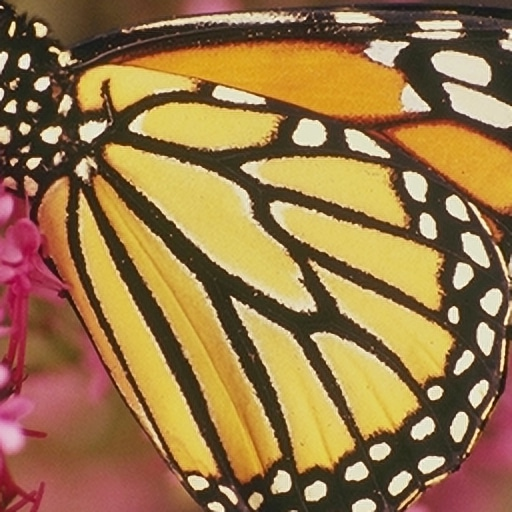

# stb-image-srcnn

Image Super-Resolution using Convolutional Neural Network.

### Introduction

**SRCNN** is a Implementation of Image Super-Resolution using SRCNN which is proposed by Chao Dong in 2014.

 - If you want to find the details of SRCNN algorithm, please read the paper:

   Chao Dong, Chen Change Loy, Kaiming He, Xiaoou Tang. Learning a Deep Convolutional Network for Image Super-Resolution, in Proceedings of European Conference on Computer Vision (ECCV), 2014
 - If you want to download the training code(caffe) or test code(Matlab) for SRCNN, please [open your browse and visit](http://mmlab.ie.cuhk.edu.hk/projects/SRCNN.html) for more details.
 - And thank you very much for Chao's work in SRCNN.

## build

### load submodules

submodules:
- [stb](https://github.com/nothings/stb.git) -> [src/stb](src/stb)

```shell
$ git submodule init
$ git submodule update
```

### install dependencies

build dependencies:

- build-essential
- cmake

```shell
$ sudo apt-get install build-essential cmake
```

### compilation
```shell
$ mkdir build
$ cd build
$ cmake ..
$ make
```
## use

The first and second parameters specify the paths to the image and the result {PNG}. The `-p` option specifies the share of the CNN in the resulting image (default 1.0).

```shell
./stbsrcnn ${IMAGE_PATH} ${IMAGE_PATH}.out.png
```

## structure

- `bicubic.h` - bicubic image scaling
- `convdata.h` - CNN weight data
- `dependencies.c` - API [stb](https://github.com/nothings/stb.git)
- `srcnn.h` - CNN apply
- `stb/` - [stb](https://github.com/nothings/stb.git)
- `stbsrcnn.c` - CLI program.

## Convolutional Neural Network

### Example

Origin (256x256:3):  
  
Bicubic interplation (x2, 512x512:3):  
  
SRCNN (only x2, 512x512:3):  
  

### Demo

You can run the following command to test the demo program.

```shell
stbsrcnn images/butterfly.png butterfly.x2.png
```
